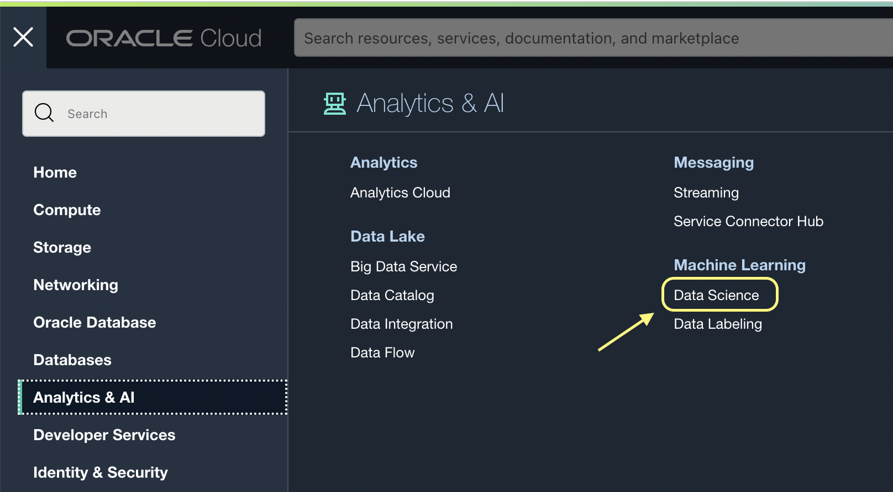
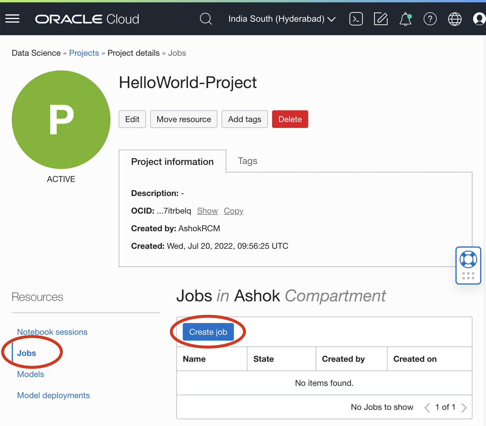
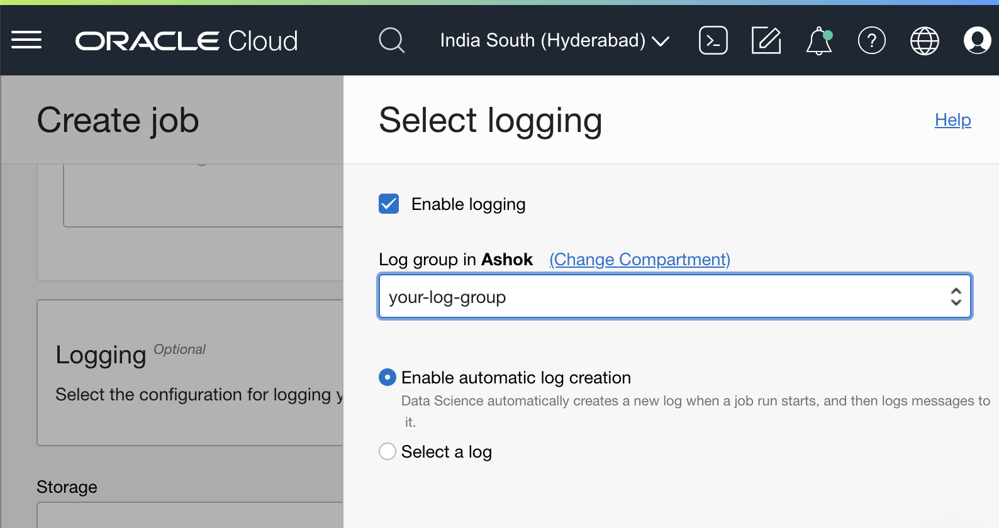
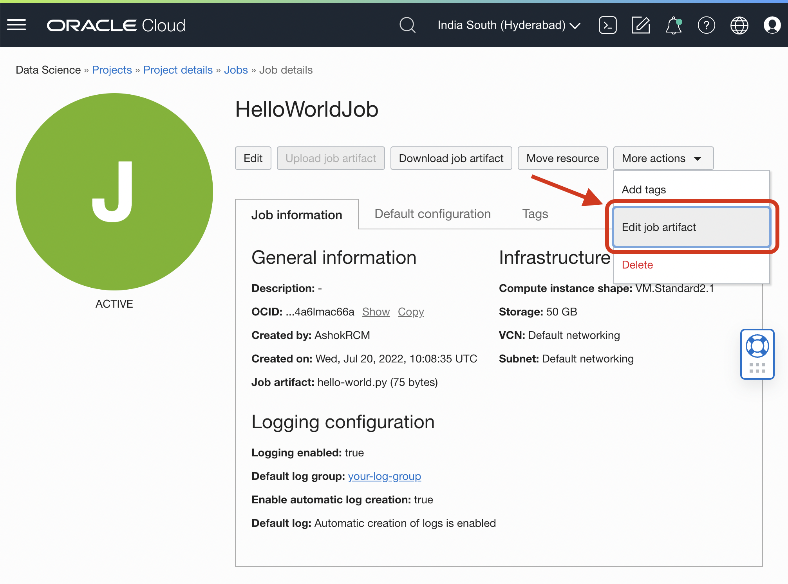
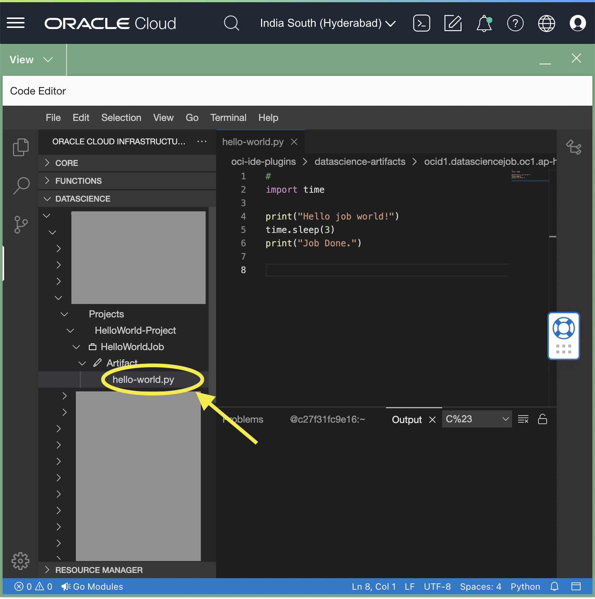
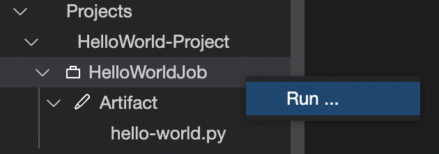
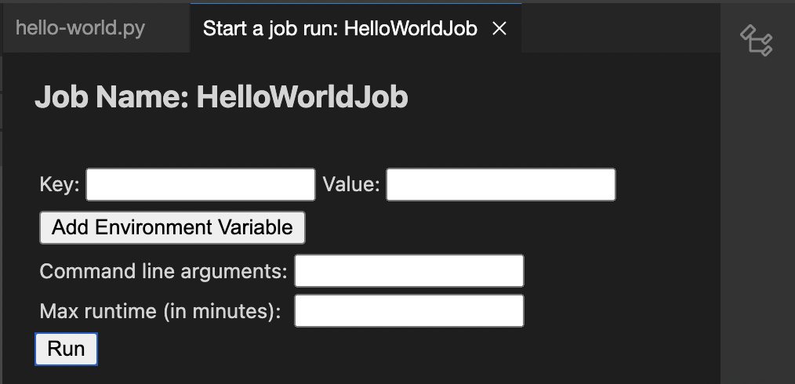
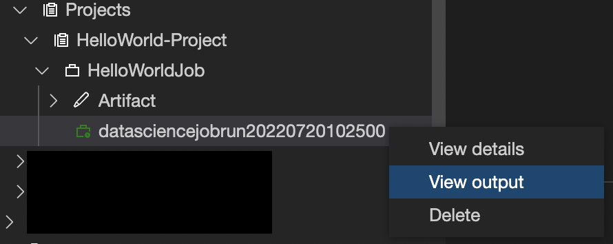

# Data Science Job Artifact editing with OCI Code Editor

## Introduction

You can now edit Data Science job artifacts on the go with OCI Code Editor with out any external or local IDE.

Oracle Data Science Service Jobs enables you to define and run a repeatable task on a fully managed infrastructure. The service enables custom tasks, as you can apply any use case you may have such as data preparation, model training, hyperparameter tuning, batch inference, etc.

Using jobs, you can:

* Run Machine Learning or Data Science tasks outside of your notebooks (JupyterLab)
* Operationalize discrete data science and machine learning tasks as reusable executable operation
* Automate your typical MLOps or CI/CD Process
* Execute batches or workloads triggered by events or actions
* Batch Inference, Mini-Batch or Distributed Batch Jobs

## Prerequisites
* Create logging group for Data Science Job. ([Documentation](https://docs.oracle.com/en-us/iaas/Content/Logging/Task/managinglogs.htm))

## Getting Started
### Step 1 - Create DS Project
* Login to [OCI Console](https://cloud.oracle.com/)
* Go to `Data Science`

* Click on `Create project`
* Choose the compartment and other details as required.
* Save the form

### Step 2 - Create DS Job
* Click on `Jobs` on left side and click further on `Create job`

* Fill in the details
    * Choose the compartment
    * Name as `HelloWorldJob`
    * Download `hello-world.py` file from this repo and upload it as artifact.
    * Under logging, click `Select` and choose pre-created logging group and tick `Enable automatic log creation` as shown here.
    
    * Storage as required. (eg. 50)
* Click on Create

### Step 3 - Open Code Editor
* From the job page, click on `Edit job artifact` under `More actions` menu as below.

Wait for Code Editor to open
* Navigate to `hello-world.py` file as below.

* Here you go, start editing your job artifact online.

### Step 4 - Execute DS Job
* To execute the job from Code Editor, click on `Run` from job context menu as below.

* Fill in run form details as required. For this sample script nothing is required. Click on `Run`.

* This would trigger the job. You can now view the job logs from either OCI console or Code Editor with below options.

## References
* [Data Science Overview](https://docs.oracle.com/en-us/iaas/data-science/using/overview.htm)
* [Creating OCI Data Science Projects](https://docs.oracle.com/en-us/iaas/data-science/using/create-projects.htm)
* [Creating OCI Data Science Jobs](https://docs.oracle.com/en-us/iaas/data-science/using/jobs-create.htm)
* [More Data Science Samples](https://github.com/oracle-samples/oci-data-science-ai-samples)
* [SDK based Data Science Job Samples](https://github.com/oracle-samples/oci-data-science-ai-samples/tree/master/jobs)

## Contributors
* Author: Ashok Raja CM
* Collaborators: NA
* Last release: July 2022

## Contributing
This project is open source.  Please submit your contributions by forking this repository and submitting a pull request!  Oracle appreciates any contributions that are made by the open source community.

## License
Copyright (c) 2024 Oracle and/or its affiliates.

Licensed under the Universal Permissive License (UPL), Version 1.0.

See [LICENSE](../LICENSE) for more details.

ORACLE AND ITS AFFILIATES DO NOT PROVIDE ANY WARRANTY WHATSOEVER, EXPRESS OR IMPLIED, FOR ANY SOFTWARE, MATERIAL OR CONTENT OF ANY KIND CONTAINED OR PRODUCED WITHIN THIS REPOSITORY, AND IN PARTICULAR SPECIFICALLY DISCLAIM ANY AND ALL IMPLIED WARRANTIES OF TITLE, NON-INFRINGEMENT, MERCHANTABILITY, AND FITNESS FOR A PARTICULAR PURPOSE.  FURTHERMORE, ORACLE AND ITS AFFILIATES DO NOT REPRESENT THAT ANY CUSTOMARY SECURITY REVIEW HAS BEEN PERFORMED WITH RESPECT TO ANY SOFTWARE, MATERIAL OR CONTENT CONTAINED OR PRODUCED WITHIN THIS REPOSITORY. IN ADDITION, AND WITHOUT LIMITING THE FOREGOING, THIRD PARTIES MAY HAVE POSTED SOFTWARE, MATERIAL OR CONTENT TO THIS REPOSITORY WITHOUT ANY REVIEW. USE AT YOUR OWN RISK. 