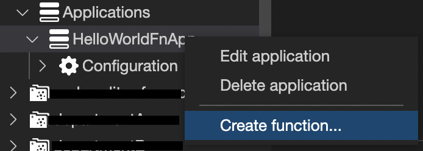
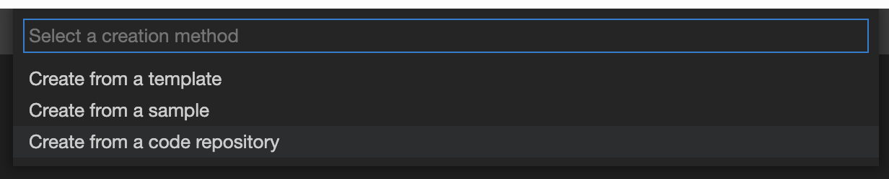
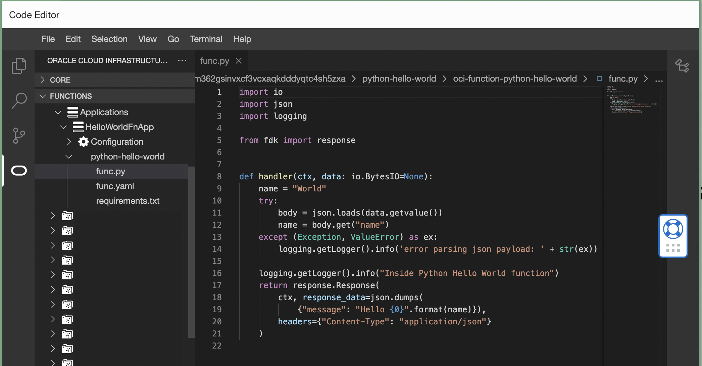
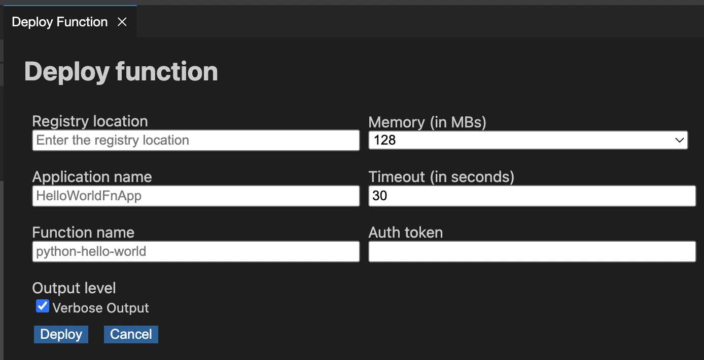

# Creating New OCI Functions with OCI Code Editor

## Introduction

You can now create/edit OCI Functions on the go with OCI Code Editor with out any external or local IDE.

Oracle Cloud Infrastructure (OCI) Functions is a serverless platform that lets developers create, run, and scale applications without managing any infrastructure. Functions integrate with Oracle Cloud Infrastructure, platform services and SaaS applications. Because Functions is based on the open source Fn Project, developers can create applications that can be easily ported to other cloud and on-premises environments. Code based on Functions typically runs for short durations, and customers pay only for the resources they use.

## Prerequisites
* [Create new application](https://docs.oracle.com/en-us/iaas/Content/Functions/Tasks/functionscreatingapps.htm) if you do not have one already.

## Getting Started
* [Click here to open Code Editor](https://cloud.oracle.com/?bdcstate=maximized&codeeditor=true) directly or login to [OCI Console](https://cloud.oracle.com/) and click   from top right corner.
* Wait for Code Editor to load and navigate to the Application on the left panel.

### Step 1 - Create New Function
* Right click on the app created and click on `Create function...`

* Choose `Create from a code repository` from top option drop down.

* Enter function name as `python-hello-world`

* Enter Git URL as `https://github.com/ashok-cm/oci-function-python-hello-world`. 
***Note:*** Fork and use the repository if you would like to try editing functions from within Code Editor.
* Click on `Add to Workspace`. 

Now you may see the code in Code Editor.

### Step 2 - Deploy Function from Code Editor
* Click on `Deploy Function` on the function context menu.

* Fill in deploy form as below

Fill `Registry Location` as your preferred OCI image registry name. (eg. `python-hello-world`)
Fill `Auth token` with OCI generated auth token.

## References
* [OCI Functions Overview](https://www.oracle.com/in/cloud/cloud-native/functions/)
* [Generating new Auth Token](https://docs.oracle.com/en-us/iaas/Content/Registry/Tasks/registrygettingauthtoken.htm)

## Contributors
* Author: Ashok Raja CM
* Collaborators: NA
* Last release: July 2022

## Contributing
This project is open source.  Please submit your contributions by forking this repository and submitting a pull request!  Oracle appreciates any contributions that are made by the open source community.

## License
Copyright (c) 2022 Oracle and/or its affiliates.

Licensed under the Universal Permissive License (UPL), Version 1.0.

See [LICENSE](../LICENSE) for more details.

ORACLE AND ITS AFFILIATES DO NOT PROVIDE ANY WARRANTY WHATSOEVER, EXPRESS OR IMPLIED, FOR ANY SOFTWARE, MATERIAL OR CONTENT OF ANY KIND CONTAINED OR PRODUCED WITHIN THIS REPOSITORY, AND IN PARTICULAR SPECIFICALLY DISCLAIM ANY AND ALL IMPLIED WARRANTIES OF TITLE, NON-INFRINGEMENT, MERCHANTABILITY, AND FITNESS FOR A PARTICULAR PURPOSE.  FURTHERMORE, ORACLE AND ITS AFFILIATES DO NOT REPRESENT THAT ANY CUSTOMARY SECURITY REVIEW HAS BEEN PERFORMED WITH RESPECT TO ANY SOFTWARE, MATERIAL OR CONTENT CONTAINED OR PRODUCED WITHIN THIS REPOSITORY. IN ADDITION, AND WITHOUT LIMITING THE FOREGOING, THIRD PARTIES MAY HAVE POSTED SOFTWARE, MATERIAL OR CONTENT TO THIS REPOSITORY WITHOUT ANY REVIEW. USE AT YOUR OWN RISK. 