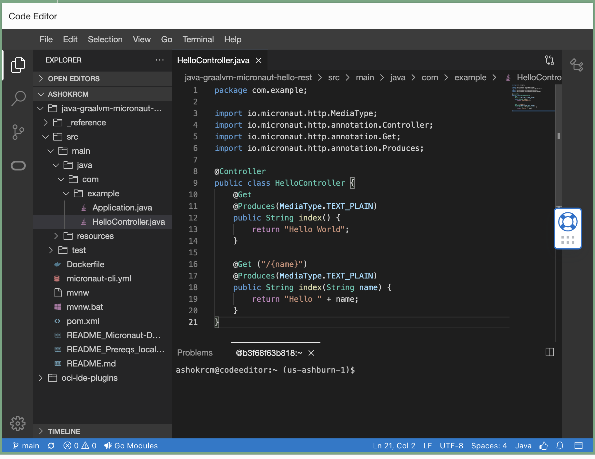
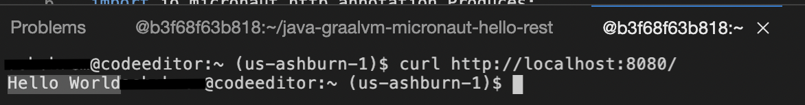

# Micronaut Hello World REST App with Oracle GraalVM in OCI Code Editor

This example shows how you can get started quickly with Oracle GraalVM in Oracle Cloud Infrastructure (OCI) Code Editor. This example uses a simple hello world REST application built with the Micronaut framework and GraalVM.

## What is GraalVM?

[GraalVM](https://www.oracle.com/in/java/graalvm/) is an advanced JDK with ahead-of-time Native Image compilation. GraalVM Native Image ahead-of-time compilation builds your Java application into a native executable that is small, starts fast, and uses less memory and CPU. Leading Java microservices frameworks such as Spring Boot, Micronaut, Quarkus and Helidon support GraalVM Native Image.

Oracle GraalVM is available for use on Oracle Cloud Infrastructure (OCI) at no additional cost.

## What is Micronaut?

[Micronaut](https://micronaut.io/) is a modern, JVM-based framework to build modular, easily testable microservice and serverless applications. By avoiding runtime reflection in favor of annotation processing, Micronaut improves the Java-based development experience by detecting errors at compile time instead of runtime, and improves Java-based application start time and memory footprint. Micronaut includes a persistence framework called Micronaut Data that precomputes your SQL queries at compilation time making it a great fit for working with databases like MySQL, Oracle Autonomous Database, etc.

Micronaut uses GraalVM Native Image to build lightweight Java applications that use less memory and CPUs, are smaller and faster because of GraalVM's advanced ahead-of-time compilation technology.

## What is Code Editor?

The Code Editor enables you to edit and deploy code for various OCI services directly from the OCI Console. You can now update service workflows and scripts without having to switch between the Console and your local development environments. This makes it easy to rapidly prototype cloud solutions, explore new services, and accomplish quick coding tasks.

Code Editor's direct integration with Cloud Shell allows you access to the Oracle GraalVM Native Image and JDK 17 (Java Development Kit) pre-installed in Cloud Shell.

## Quick Launch

If you have your OCI tenancy and want to try out this sample, click on 'Open in Code Editor' button below.

[](https://cloud.oracle.com/?region=home&cs_repo_url=https://github.com/oracle-devrel/oci-code-editor-samples.git&cs_open_ce=true&cs_readme_path=README.md&cs_initscript_path=./java-samples/graalvmee-java-micronaut-hello-rest/run-on-cloud-shell.sh)

This button automates up to Step 3 on your OCI Cloud Shell and opens the code in OCI Code Editor to continue with Step 4 manually.

If you like to do it fully manually yourself, start from Step 1 below.

## Step 1: Open Terminal in Code Editor

1. [Login to OCI Console and launch Code Editor](https://cloud.oracle.com/?bdcstate=maximized&codeeditor=true).

2. Open a `New Terminal` in Code Editor. Use this Terminal window to run the commands shown in this sample.

    

## Step 2: Select GraalVM as the current JDK

1. List the installed JDKs:

    ```shell
    csruntimectl java list
    ```

    The output should be similar to (versions may vary):

    ```shell
      graalvmjdk-17                                                      /usr/lib64/graalvm/graalvm-java17
    * oraclejdk-11                                                                   /usr/java/jdk-11.0.17
      oraclejdk-1.8                                                        /usr/lib/jvm/jdk-1.8-oracle-x64
    ```

2. Select GraalVM as the current JDK:

    ```shell
    csruntimectl java set graalvmjdk-17
    ```

    The output should be similar to:

    ```shell
    The current managed java version is set to graalvmjdk-17.
    ```

## Step 3: Set up your project

1. Git clone this example.

    ```shell
    git init graalvm-java-mn-hello-rest

    cd graalvm-java-mn-hello-rest

    git remote add origin https://github.com/oracle-devrel/oci-code-editor-samples.git

    git config core.sparsecheckout true

    echo "java-samples/graalvmee-java-micronaut-hello-rest/*">>.git/info/sparse-checkout

    git pull --depth=1 origin main

    cd java-samples/graalvmee-java-micronaut-hello-rest/

    ```

    You can now view/change the sample code in code editor.

    

2. [OPTIONAL] Confirm software version and environment variables.

    [Check software version and environment variables](./README-check-version-env-vars.md)

## Step 4: Build and run as a JAR

1. Build a JAR file for the example app

    ```shell
    ./mvnw package
    ```

2. Run the JAR in the background

    ```shell
    java -jar target/MnHelloRest-0.1.jar &
    ```

    

3. Test the JAR

    3.1) Should output "Hello World"

    ```shell
    curl http://localhost:8080/
    ```

    3.2) Should output "Hello Micronaut"

    ```shell
    curl http://localhost:8080/Micronaut
    ```

    

4. Bring the running JAR in the foreground

    ```shell
    fg
    ```

5. Once the app is running in the foreground, press CTRL+C to stop it.

## Step 4: Build and run a native executable

Use GraalVM Native Image to produce a native executable.

1. Build the app native executable

    ```shell
    ./mvnw package -Dpackaging=native-image
    ```

2. Run the app native executable in the background

    ```shell
    ./target/MnHelloRest &
    ```

3. Test the app native executable

    3.1) Should output "Hello World"

    ```shell
    curl http://localhost:8080/
    ```

    3.2) Should output "Hello Micronaut-Graal-Native"

    ```shell
    curl http://localhost:8080/Micronaut-Graal-Native
    ```

4. Bring the running app JAR in the foreground

    ```shell
    fg
    ```

5. Once the app is running in the foreground, press CTRL+C to stop it.

## References

* [Oracle GraalVM Overview](https://www.oracle.com/in/java/graalvm/)
* [Oracle GraalVM Documentation](https://docs.oracle.com/en/graalvm/index.html)
* [Micronaut - Microservices and Serverless Application Framework](https://micronaut.io/)

## Contributors

* Author: Sachin Pikle
* Collaborators: Ashok Raja CM
* Last updated: January 2024

## Contributing

This project is open source.  Please submit your contributions by forking this repository and submitting a pull request!  Oracle appreciates any contributions that are made by the open source community.

## License

Copyright (c) 2024 Oracle and/or its affiliates.

Licensed under the Universal Permissive License (UPL), Version 1.0.

See [LICENSE](../LICENSE) for more details.

ORACLE AND ITS AFFILIATES DO NOT PROVIDE ANY WARRANTY WHATSOEVER, EXPRESS OR IMPLIED, FOR ANY SOFTWARE, MATERIAL OR CONTENT OF ANY KIND CONTAINED OR PRODUCED WITHIN THIS REPOSITORY, AND IN PARTICULAR SPECIFICALLY DISCLAIM ANY AND ALL IMPLIED WARRANTIES OF TITLE, NON-INFRINGEMENT, MERCHANTABILITY, AND FITNESS FOR A PARTICULAR PURPOSE.  FURTHERMORE, ORACLE AND ITS AFFILIATES DO NOT REPRESENT THAT ANY CUSTOMARY SECURITY REVIEW HAS BEEN PERFORMED WITH RESPECT TO ANY SOFTWARE, MATERIAL OR CONTENT CONTAINED OR PRODUCED WITHIN THIS REPOSITORY. IN ADDITION, AND WITHOUT LIMITING THE FOREGOING, THIRD PARTIES MAY HAVE POSTED SOFTWARE, MATERIAL OR CONTENT TO THIS REPOSITORY WITHOUT ANY REVIEW. USE AT YOUR OWN RISK.
