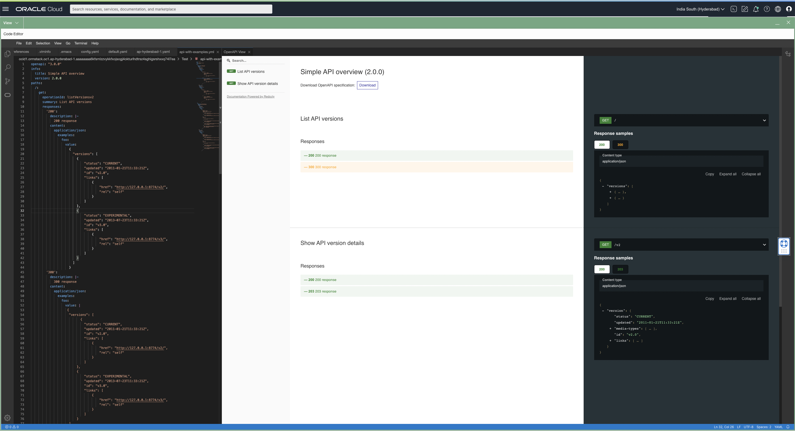
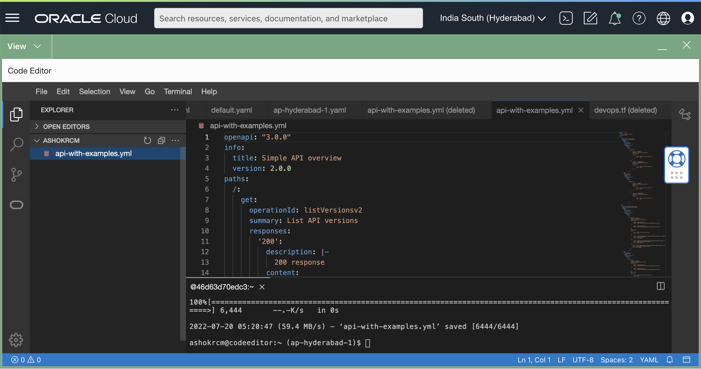
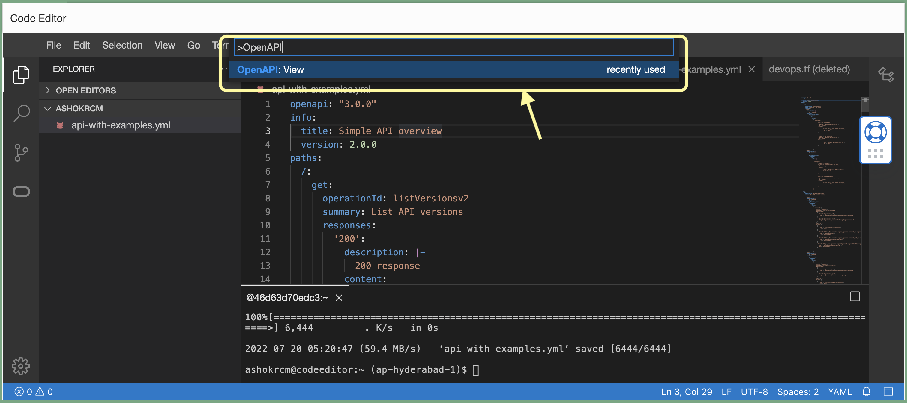
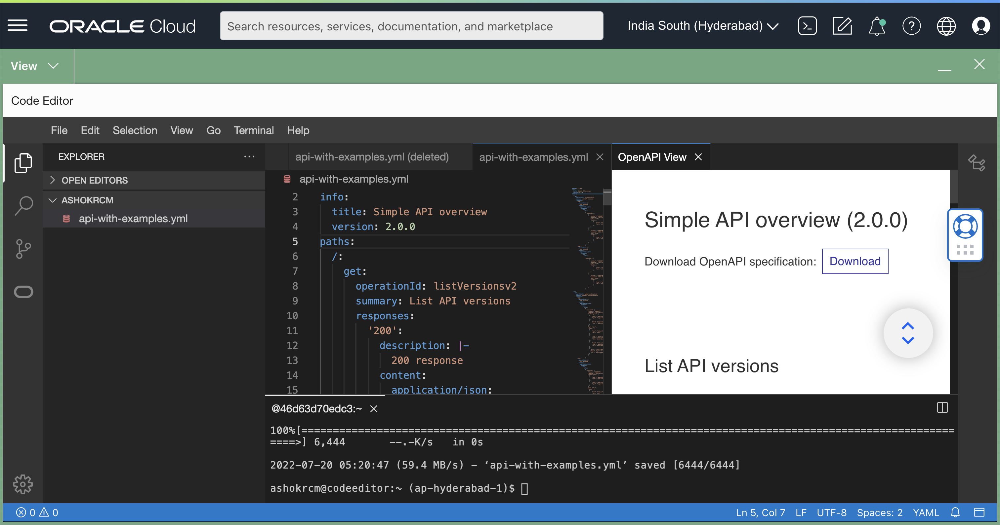

# OpenAPI Preview with OCI Code Editor

## Introduction
OpenAPI specification file (earlier called as Swagger spec) is now viewable with OCI Code Editor. This makes developer life easy to view spec changes instantly on a side by side view as shown below.




## Getting Started
### Step 1
* Login to OCI console and click   from top right corner.
* Wait for Code Editor to load

### Step 2
Note: If you already have the file in your Code Editor workspace, please ignore this step. This steps illustrates to download sample OpenAPI file.
* Open Terminal inside Code Editor.
* Run below command to download sample OpenAPI YAML file.
```
wget https://raw.githubusercontent.com/oracle-devrel/oci-code-editor-samples/main/open-api-view/api-with-examples.yml
```
* After download, please click/select the downloaded file `api-with-example.yml` as below from left side file view.


### Step 3
* Press `Ctrl/Cmd` + `Shift` + `P` to open command palate.
* Look for `OpenAPI: View` in the dropdown and select/click the same. You may also use filter to search the item.

* This opens up OpenAPI Preview on the side for the opened file.


## References
* [OpenAPI Specifications](https://swagger.io/specification/)

## Contributors
* Author: Ashok Raja CM
* Collaborators: NA
* Last release: July 2022

## Contributing
This project is open source.  Please submit your contributions by forking this repository and submitting a pull request!  Oracle appreciates any contributions that are made by the open source community.

## License
Copyright (c) 2022 Oracle and/or its affiliates.

Licensed under the Universal Permissive License (UPL), Version 1.0.

See [LICENSE](LICENSE) for more details.

ORACLE AND ITS AFFILIATES DO NOT PROVIDE ANY WARRANTY WHATSOEVER, EXPRESS OR IMPLIED, FOR ANY SOFTWARE, MATERIAL OR CONTENT OF ANY KIND CONTAINED OR PRODUCED WITHIN THIS REPOSITORY, AND IN PARTICULAR SPECIFICALLY DISCLAIM ANY AND ALL IMPLIED WARRANTIES OF TITLE, NON-INFRINGEMENT, MERCHANTABILITY, AND FITNESS FOR A PARTICULAR PURPOSE.  FURTHERMORE, ORACLE AND ITS AFFILIATES DO NOT REPRESENT THAT ANY CUSTOMARY SECURITY REVIEW HAS BEEN PERFORMED WITH RESPECT TO ANY SOFTWARE, MATERIAL OR CONTENT CONTAINED OR PRODUCED WITHIN THIS REPOSITORY. IN ADDITION, AND WITHOUT LIMITING THE FOREGOING, THIRD PARTIES MAY HAVE POSTED SOFTWARE, MATERIAL OR CONTENT TO THIS REPOSITORY WITHOUT ANY REVIEW. USE AT YOUR OWN RISK. 