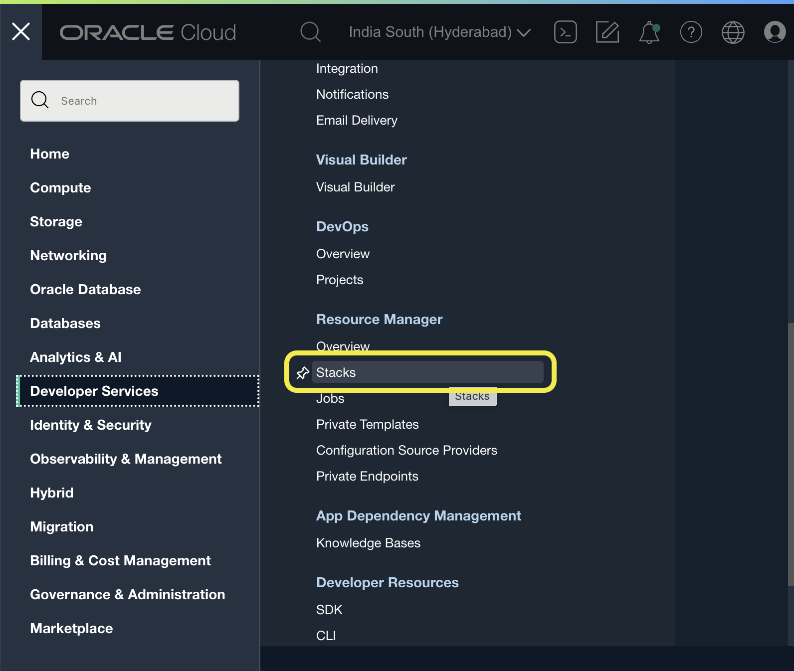
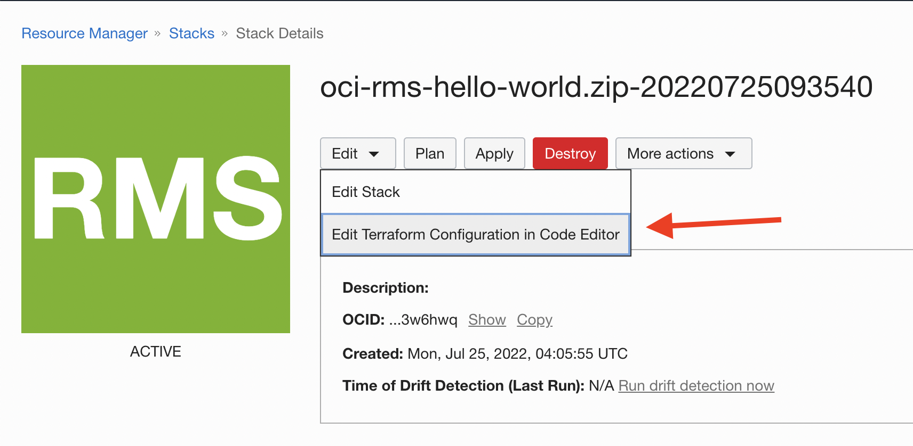
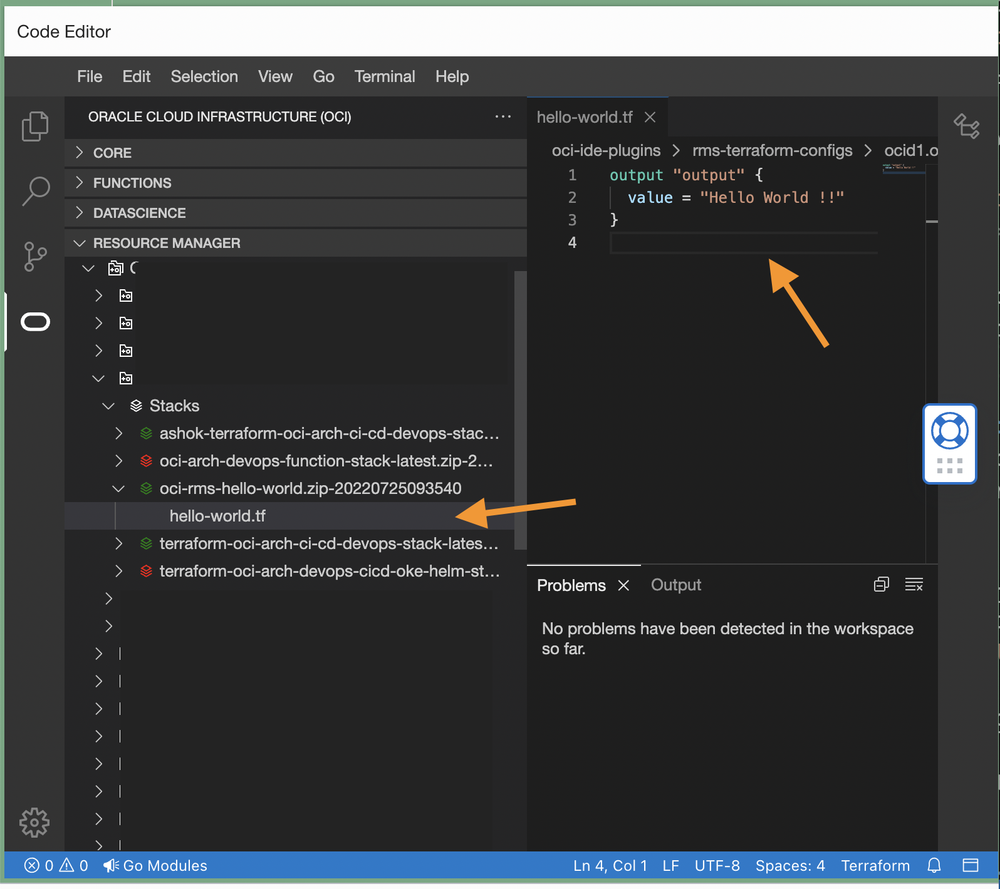
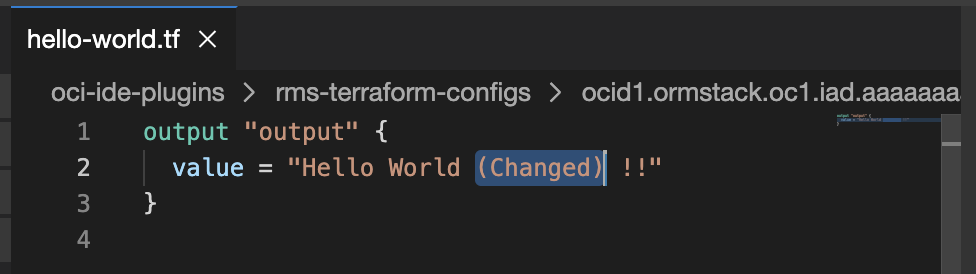
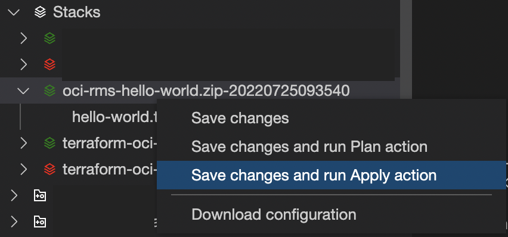
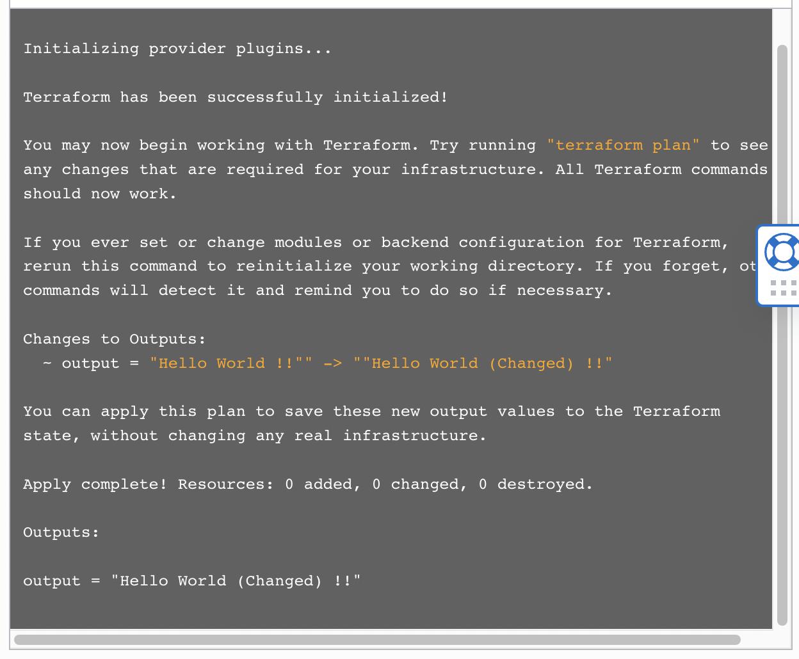

# Resource Manager Stack editing with OCI Code Editor

## Introduction

You can now edit Resource Manager Stack bundle on the go with OCI Code Editor with out any external or local IDE.

Resource Manager is an Oracle Cloud Infrastructure service that allows you to automate the process of provisioning your Oracle Cloud Infrastructure resources. Using Terraform, Resource Manager helps you install, configure, and manage resources through the "infrastructure-as-code" model.

## Getting Started
### Step 1 - Create New Resource Manager Stack
#### Option 1 (via Hello World Stack)
1. Click  to deploy sample Hello World Resource Manager Stack.

    If you aren't already signed in, when prompted, enter the tenancy and user credentials.

2. Review and accept the terms and conditions.
3. Follow the on-screen prompts and instructions to create the stack.
4. After creating the stack, click **Terraform Actions**, and select **Plan**.
5. Wait for the job to be completed, and review the plan.

    To make any changes, return to the Stack Details page, click **Edit Stack**, and make the required changes. Then, run the **Plan** action again.
6. If no further changes are necessary, return to the Stack Details page, click **Terraform Actions**, and select **Apply**.

#### Option 2 (with Manual RM stack)
* Login to [OCI Console](https://cloud.oracle.com/)
* Go to `Developer Services > Resource Manager > Stacks`

* Click on `Create Stack`
* Create the stack manually

### Step 2 - Open Code Editor
* Click on `Edit Terraform Configuration in Code Editor` under `Edit` menu of created Resource Manager Stack as below.

* Wait for the code editor to launch. Or [Click here to open Code Editor](https://cloud.oracle.com/?bdcstate=maximized&codeeditor=true) directly or login to OCI console and click   from top right corner.
* Navigate to Terraform code as shown below for 'Hello World'

### Step 3 - Change and Apply new Changes
* Change terraform code (Sample below)

* Save and apply the changes from code editor with below menu option.

* You may see the results from OCI console under jobs of the selected Resource Manager Stack. Clicking on the job will open up logs as below.

(You may see the changes applied)

## References
* [Resource Manager Documentation](https://docs.oracle.com/en-us/iaas/Content/ResourceManager/Concepts/resourcemanager.htm)
* [Terraform Automated OCI Solutions](https://docs.oracle.com/solutions/)

## Contributors
* Author: Ashok Raja CM
* Collaborators: NA
* Last release: July 2022

## Contributing
This project is open source.  Please submit your contributions by forking this repository and submitting a pull request!  Oracle appreciates any contributions that are made by the open source community.

## License
Copyright (c) 2022 Oracle and/or its affiliates.

Licensed under the Universal Permissive License (UPL), Version 1.0.

See [LICENSE](../LICENSE) for more details.

ORACLE AND ITS AFFILIATES DO NOT PROVIDE ANY WARRANTY WHATSOEVER, EXPRESS OR IMPLIED, FOR ANY SOFTWARE, MATERIAL OR CONTENT OF ANY KIND CONTAINED OR PRODUCED WITHIN THIS REPOSITORY, AND IN PARTICULAR SPECIFICALLY DISCLAIM ANY AND ALL IMPLIED WARRANTIES OF TITLE, NON-INFRINGEMENT, MERCHANTABILITY, AND FITNESS FOR A PARTICULAR PURPOSE.  FURTHERMORE, ORACLE AND ITS AFFILIATES DO NOT REPRESENT THAT ANY CUSTOMARY SECURITY REVIEW HAS BEEN PERFORMED WITH RESPECT TO ANY SOFTWARE, MATERIAL OR CONTENT CONTAINED OR PRODUCED WITHIN THIS REPOSITORY. IN ADDITION, AND WITHOUT LIMITING THE FOREGOING, THIRD PARTIES MAY HAVE POSTED SOFTWARE, MATERIAL OR CONTENT TO THIS REPOSITORY WITHOUT ANY REVIEW. USE AT YOUR OWN RISK. 